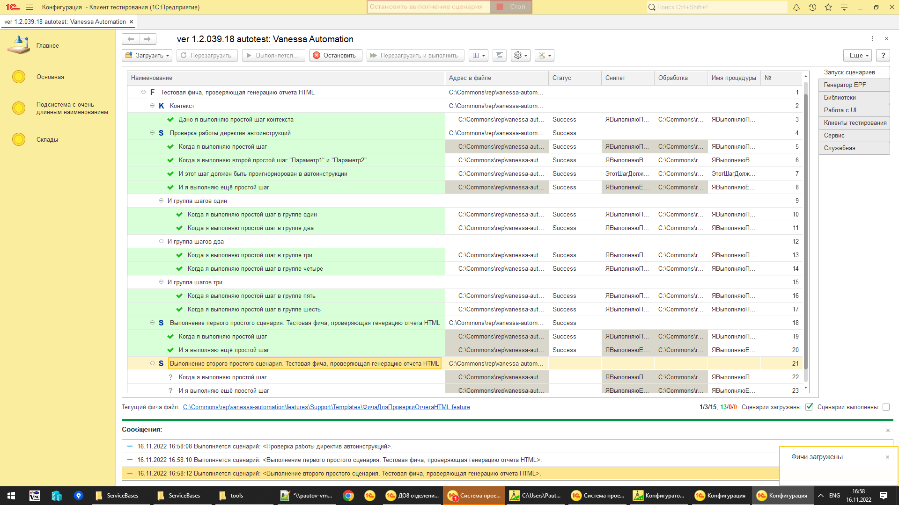
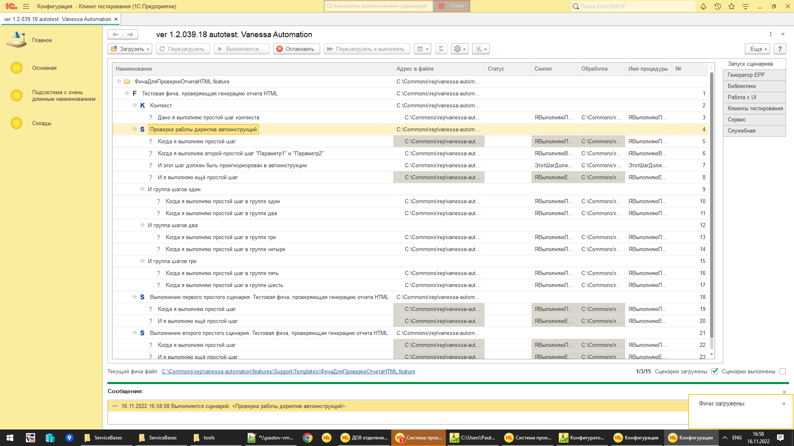

Другой текст первого шага

Другой текст второго шага Параметр2 и Параметр1

И я выполняю ещё простой шаг

И группа шагов один

И группа другой текст

Когда я выполняю простой шаг

И я выполняю ещё простой шаг

Когда я выполняю простой шаг

И я выполняю ещё простой шаг

